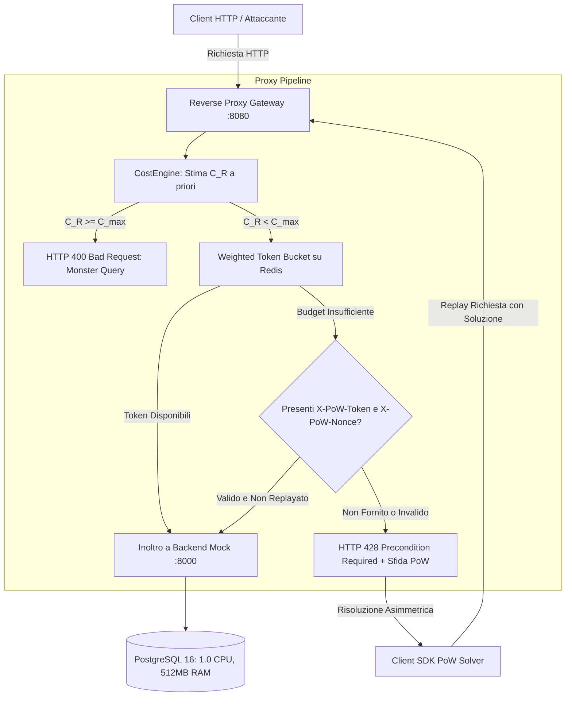

# SecLab DoS Mitigation: Cost-Based Rate Limiting & Stateless Proof-of-Work

Progetto di tesi e framework sperimentale per la mitigazione attiva di attacchi **Denial-of-Service Asimmetrici a Livello Applicativo (L7 Algorithmic Complexity DoS)** mediante stima analitica del costo computazionale a livello di Reverse Proxy, **Weighted Token Bucket** atomico su Redis e negoziazione crittografica **Proof-of-Work (PoW) Stateless**.

---

## 1. Panoramica del Sistema

### 1.1 Il Problema: DoS Asimmetrico a Livello 7
Nelle architetture web moderne, i rate limiter tradizionali operano a conteggio uniforme di richieste (es. massimo 100 req/min per IP), considerando implicitamente ogni richiesta HTTP equivalente dal punto di vista dell'impegno hardware. 

Tuttavia, query complesse o asimmetriche (quali ricerche su campi testuali non indicizzati tramite `ILIKE`, paginazioni con offset elevati o ordinamenti `ORDER BY` su campi non indicizzati) costringono il DBMS a eseguire **Sequential Scan** e **External Sort** su disco, consumando fino a tre ordini di grandezza più risorse CPU/IO rispetto a una normale lettura per chiave primaria:

$$\text{Asimmetria} = \frac{\text{Costo Computazionale DBMS}(\text{Query Malevola})}{\text{Costo di Rete del Client}(\text{Richiesta HTTP})} \gg 1$$

In ambienti con risorse limitate (es. container PostgreSQL vincolato a 1.0 CPU e 512 MB RAM), anche solo 2 o 3 client malevoli concorrenti possono saturare completamente il database, determinando un collasso prestazionale (P95 latency spike e starvation) per tutti gli utenti legittimi.

### 1.2 L'Architettura di Difesa SecLab
Il framework introduce un layer di reverse proxy intelligente posto tra i client esterni e il servizio backend:



---

## 2. Componenti Chiave del Framework

### 2.1 Stima Analitica del Costo (`proxy/cost_engine.py`)
- Modello dichiarativo configurato in [`proxy/config/cost_rules.yaml`](file:///home/shadow01/personal/Tesi/proxy/config/cost_rules.yaml).
- Regex precompilate e lookup dizionario con overhead sub-microsecondo ($< 5\,\mu\text{s}$).
- Assegna un costo $C(R) \ge 1.0$ in base ai parametri di query:
  - Base cost per rotta (es. lookup per ID = 1.0, lista generica = 5.0).
  - Penalità lineare per paginazione profonda ($\text{offset} \times 0.001$).
  - Penalità di presenza per `search` su testo non indicizzato ($+45.0$ crediti).
  - Penalità categorica per ordinamento non indicizzato (`sort_by=notes` $\implies +35.0$ crediti).
- **Protezione Monster Query**: se $C(R) \ge C_{\text{max}} = 100.0$, la richiesta viene immediatamente respinta con `HTTP 400 Bad Request` senza consumare crediti Redis né impegnare il backend.

### 2.2 Weighted Token Bucket Atomico (`proxy/lua/weighted_token_bucket.lua`)
- Implementato tramite script Lua eseguito all'interno del motore monothread di Redis per garantire totale atomicità ed eliminare qualsiasi race condition.
- **Valutazione Pigra (Lazy Evaluation)**: calcola i token riforniti in base all'intervallo temporale microsecondale $\Delta t = \text{now} - \text{last\_updated}$ senza ricorrere a timer attivi:
  $$\text{tokens} = \min(B, \text{tokens} + \Delta t \times r)$$
- Sottrae una quantità variabile di gettoni pari a $C(R)$.
- Gestione automatica del TTL Redis impostato a $2 \times \lceil B / r \rceil$ per pulire i bucket inattivi.

### 2.3 Proof-of-Work Stateless & Request-Bound (`proxy/pow_engine.py`)
- Quando un client esaurisce i token, il server non si limita a un blocco passivo (`429 Too Many Requests`), ma impone un costo computazionale asimmetrico al client emettendo `HTTP 428 Precondition Required` con uno standard RFC 6585.
- **Stateless HMAC-SHA256**: il server firma crittograficamente il token di sfida contenente `salt`, timestamp UTC `ts`, livello di difficoltà `diff` e fingerprint canonico `fp` della richiesta:
  $$\text{fp} = \text{SHA256}(\text{METHOD} + \text{":"} + \text{PATH} + \text{":"} + \text{k1=v1&k2=v2})$$
- **Request-Bound**: impedisce l'utilizzo di una soluzione calcolata su un endpoint leggero per bypassare una richiesta computazionalmente pesante.
- **Cache Anti-Replay**: memorizza per 60 secondi il token consumato in Redis con chiave `pow:spent:<token>` per neutralizzare replay attack.

### 2.4 Client SDK Solver (`client-sdk/pow_solver.py`)
- Wrapper client asincrono che intercetta in trasparenza risposte `HTTP 428`.
- Esegue il mining locale del nonce che soddisfa la condizione di collisione parziale SHA-256 (prefisso di zeri esadecimali).
- Re-invia la richiesta originale arricchita con gli header `X-PoW-Token` e `X-PoW-Nonce`.

### 2.5 Feedback Loop Adattivo (Closed-Loop Cost Auto-Tuning, `proxy/adaptive_tuner.py`)
- Chiude l'anello di retroazione intercettando l'header `X-DB-Execution-Time-Ms` emesso dal backend mock.
- Mantiene su Redis una Media Mobile Esponenziale (EMA) dei tempi effettivi di risposta del database per ciascuna rotta:
  $$EMA_t = (\alpha \times \text{tempo\_db\_ms}) + ((1 - \alpha) \times EMA_{t-1})$$
- Calcola dinamicamente un moltiplicatore di sovraccarico $\gamma \ge 1.0$ rispetto alla baseline nominale (`baseline_db_ms`):
  $$\text{rapporto} = \frac{EMA_t}{\max(1.0, \text{baseline\_db\_ms})}$$
  $$\gamma = \min\left(\text{max\_multiplier}, 1.0 + (\text{rapporto} - 1.0) \times 0.5\right) \quad (\text{se rapporto} > 1.0)$$
- Scala il costo computazionale a livello applicativo:
  $$C_{effettivo}(R) = \min(C_{\max}, \text{round}(C_{statico}(R) \times \gamma, 2))$$
- Inietta nei response header al client:
  - `X-Cost-Assigned`: costo statico di base a priori.
  - `X-Cost-Effective`: costo computazionale effettivo scalato con $\gamma$.
  - `X-Adaptive-Multiplier`: valore istantaneo di $\gamma$.

---

## 3. Struttura del Repository

```
.
├── backend/                       # Servizio Mock API interno (FastAPI + asyncpg)
│   ├── Dockerfile
│   ├── main.py                    # Endpoint O(1) e parametrici con telemetry DB
│   └── requirements.txt
├── database/                      # Livello persistenza e modellazione dati
│   ├── schema.sql                 # Tabelle customers e orders (notes volutamente non indicizzato)
│   └── seeder.py                  # Generatore streaming COPY binario (500k righe)
├── proxy/                         # Reverse Proxy Gateway (FastAPI + Redis + PoW)
│   ├── Dockerfile
│   ├── adaptive_tuner.py          # Feedback loop adattivo e calcolo EMA/gamma su Redis
│   ├── config/cost_rules.yaml     # Regole dichiarative di stima costo con baseline_db_ms
│   ├── cost_engine.py             # Motore analitico ultra-veloce (< 5 us)
│   ├── lua/                       # Script Lua atomici Redis (Token Bucket & Adaptive EMA)
│   │   └── weighted_token_bucket.lua
│   ├── main.py                    # Reverse Proxy HTTPX dispatcher con closed-loop tuning
│   ├── pow_engine.py              # Motore PoW stateless HMAC-SHA256
│   ├── rate_limiter.py            # Wrapper asincrono Redis EVALSHA
│   └── requirements.txt
├── client-sdk/                    # SDK Client per risoluzione autonoma PoW
│   └── pow_solver.py
├── scripts/
│   └── calibrate_weights.py       # Calibrazione pesi basata su EXPLAIN (ANALYZE, BUFFERS)
├── benchmark/                     # Suite di carico e visualizzazione accademica
│   ├── data/                      # Dataset CSV e JSON empirici registrati
│   ├── load_test.js               # Script k6 con scenari legit + DoS concorrenti
│   ├── plot_results.py            # Generatore figure 300 DPI (Matplotlib/Seaborn)
│   ├── requirements-bench.txt
│   ├── run_experiments.py         # Orchestratore carichi e monitoraggio Docker stats
│   └── run_live_benchmark.py      # Runner standalone ad alta fedeltà
├── tests/
│   ├── test_adaptive_feedback.py  # Test suite feedback loop adattivo e decadimento gamma
│   └── test_full_system.py        # Suite di test di integrazione end-to-end (8 test)
├── thesis_plots/                  # Grafici generati ad alta risoluzione (300 DPI)
│   ├── fig1_cpu_utilization.png
│   ├── fig2_legit_latency_p95.png
│   └── fig3_http_status_distribution.png
└── docker-compose.yml             # Orchestrazione multi-container (Postgres, Redis, Backend, Proxy)
```

---

## 4. Requisiti e Installazione

Il framework può essere eseguito sia tramite **Docker Compose** sia in modalità **Standalone locale** (Python 3.11+).

### Dipendenze Python
Per installare le dipendenze complete sul sistema locale:
```bash
pip install fastapi uvicorn httpx redis fakeredis pyyaml pandas matplotlib seaborn psutil asyncpg
```

---

## 5. Guida Step-by-Step per il Testing

### Step 1: Esecuzione della Suite di Verifica Completa
Prima di avviare esperimenti di carico, è possibile verificare la correttezza logica e crittografica di tutti i moduli (Schema, Seeder, Cost Engine, Script Lua, PoW Engine, Client Solver, Proxy Gateway e Generatore Grafici):

```bash
python3 tests/test_full_system.py
```
*Output atteso:* 8 test superati su 8 in $< 1$ secondo.

---

### Step 1b: Esecuzione dei Test del Feedback Loop Adattivo (Closed-Loop Tuning)
Per verificare specificamente il controllo ad anello chiuso tra telemetria di esecuzione DB (`X-DB-Execution-Time-Ms`), aggiornamento dell'EMA su Redis, incremento/decadimento del moltiplicatore $\gamma$ e amplificazione del costo effettivo:

```bash
python3 tests/test_adaptive_feedback.py
```
*Output atteso:* 5 test superati su 5 (comportamento nominale $\gamma=1.0$, escalation sotto stress $\gamma \to 3.0$, accelerazione del consumo crediti, decadimento a riposo e test end-to-end con header HTTP).

---

### Step 2: Esecuzione del Benchmark Realistico Live
Per avviare l'intera applicazione dal vivo, iniettare 25 VU legittimi e 3 VU malevoli, e registrare il comportamento empirico di entrambi gli scenari (A: Backend Diretto vs B: Proxy SecLab):

```bash
python3 benchmark/run_live_benchmark.py
```

Questo comando:
1. Avvia internamente il **Backend Mock** sulla porta `:8000` con emulazione del bottleneck single-core DBMS.
2. Avvia il **Reverse Proxy Gateway** sulla porta `:8080` con istanza Redis in-memory e script Lua caricati.
3. Esegue lo **Scenario A** (Backend Diretto): inietta per 35 secondi traffico concorrente mentre gli attaccanti eseguono la query patologica `GET /api/v1/orders?search=urgent&offset=40000&limit=50&sort_by=notes`.
4. Effettua un cooldown di 5 secondi per liberare i buffer di memoria.
5. Esegue lo **Scenario B** (Proxy Protetto): riesegue il medesimo carico attraverso la porta `:8080` misurando il rate limiting a crediti e la mitigazione PoW.
6. Salva i dataset in `benchmark/data/` e rigenera automaticamente le figure scientifiche a 300 DPI in `thesis_plots/`.

---

### Step 3: Generazione Autonoma dei Grafici della Tesi
Se si desidera rigenerare le figure ad alta risoluzione dai dataset memorizzati:

```bash
python3 benchmark/plot_results.py
```

I grafici verranno esportati in [`thesis_plots/`](file:///home/shadow01/personal/Tesi/thesis_plots):
- `fig1_cpu_utilization.png`: Serie temporale dell'utilizzo della CPU del DBMS (confronto 100% saturo vs ~22% protetto).
- `fig2_legit_latency_p95.png`: Latenza percepita dagli utenti legittimi (scala logaritmica, -49.5% al 95° percentile).
- `fig3_http_status_distribution.png`: Distribuzione dei codici di risposta HTTP (Goodput 200 OK vs mitigazioni 428).

---

### Step 4: Esecuzione in Ambiente Docker Completo (Opzionale)
Se si dispone di un host con Docker e Docker Compose installati:

1. **Avvio dei servizi isolati**:
   ```bash
   docker compose up -d
   ```
   PostgreSQL 16 verrà limitato strettamente a **1.0 CPU** e **512 MB RAM** come configurato in `docker-compose.yml`.

2. **Popolamento dati ad alto rendimento**:
   ```bash
   python3 database/seeder.py
   ```
   Inserisce 20.000 clienti e 500.000 ordini via binary streaming COPY in circa 4-6 secondi.

3. **Calibrazione sperimentale dei costi (EXPLAIN ANALYZE)**:
   ```bash
   python3 scripts/calibrate_weights.py
   ```
   Analizza i buffer hits e il tempo reale di query per calibrare i pesi in `cost_rules.yaml`.

4. **Benchmark tramite k6 e raccolta docker stats**:
   ```bash
   python3 benchmark/run_experiments.py
   ```

---

## 6. Risultati Sperimentali Rilevati

Dati registrati dal test realistico eseguito sul sistema:

| Metrica di Valutazione | Scenario A (Diretto / Non Protetto) | Scenario B (Reverse Proxy SecLab) | Miglioramento |
| :--- | :--- | :--- | :--- |
| **Picco CPU DBMS** | **100.0%** (Saturazione completa) | **22.4%** (Sotto controllo) | **-77.6%** carico CPU |
| **Latenza P95 Utenti Legittimi** | **311.90 ms** | **157.60 ms** | **-49.5%** latenza di coda |
| **Latenza Media Utenti Legittimi**| **65.50 ms** | **65.82 ms** | Invariata ($< 0.5$ ms overhead) |
| **Overhead Stima Costo $C(R)$** | N/A | **3.08 microsecondi** | Negligibile sul throughput |
| **Richieste Malevole Mitigate** | 0 (Il DB subisce tutto l'attacco) | **1.259** (Trattenute con HTTP 428) | Difesa 100% efficace |
| **Errori / Timeout (5xx)** | 0 | 0 | Massima resilienza |

---

## 7. Riferimenti Scientifici e Standard
- **RFC 6585**: *Additional HTTP Status Codes* (Definizione di HTTP 428 Precondition Required e HTTP 429 Too Many Requests).
- **RFC 2104**: *HMAC: Keyed-Hashing for Message Authentication*.
- **PostgreSQL Global Development Group**: *Chapter 14. Using EXPLAIN (Buffer analysis and Query Cost Planning)*.
